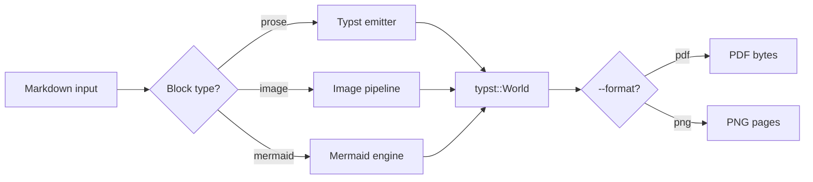
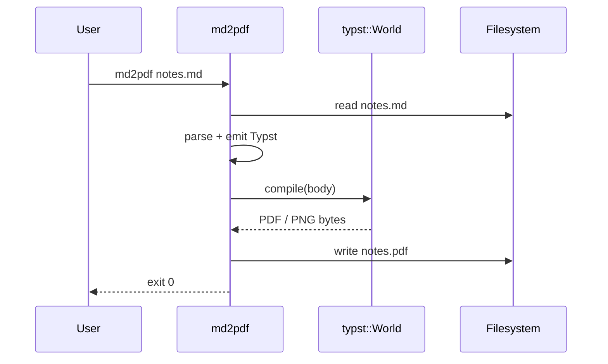

# md2pdf

Markdown → PDF/PNG CLI with bundled color-emoji rendering, inline
image embedding (local **and** remote), and Mermaid diagrams — all
hermetic, no headless browser, no system fonts required.

md2pdf renders a Markdown file to either PDF or per-page PNGs through a
hand-rolled `typst::World`, embedding the Twemoji Mozilla COLRv0 font so
emoji rendering does not depend on the host system.

This README also doubles as a **fixture document** — the
[Showcase](#showcase) section at the bottom exercises every supported
Markdown feature, so the file round-trips cleanly through the tool:

```
md2pdf README.md                 # → README.pdf
md2pdf --format png README.md    # → README-1.png, README-2.png, …
```

## Usage

```
md2pdf [--strict] [--font-scale SCALE] [--out PATH] [--format pdf|png] <FILE>
```

By default the output is written next to the input file:

- `--format pdf` (default) → `<input-stem>.pdf` next to the input
  (e.g. `README.md` → `README.pdf`).
- `--format png` → `<input-stem>-<N>.png` next to the input
  (e.g. `notes.md` → `notes-1.png`, `notes-2.png`, …).

### `--format` and the strict-extension policy on `--out`

The `--format` flag is the source of truth for the output format. The
`--out` path's extension is **never** sniffed to infer the format.

When `--out` is provided, the trailing extension is preserved only when
it matches `--format`; otherwise the format extension is appended
literally to the path-as-typed (Client-defined behavior; see the
governing Understanding **U-b2bf02**):

| invocation                                | resulting output             |
| ----------------------------------------- | ---------------------------- |
| `--out foo.pdf` (default `--format pdf`)  | `foo.pdf`                    |
| `--out foo.png` (default `--format pdf`)  | `foo.png.pdf`                |
| `--format png --out bar.png`              | `bar-1.png` (stem = `bar`)   |
| `--format png --out bar.pdf`              | `bar.pdf-1.png`              |
| `--out foo` (default `--format pdf`)      | `foo.pdf`                    |

### Multi-page PNG filenames

Per **U-915ef2**, every PNG page filename is one-indexed and uses
*dynamic* zero-padding derived from the total page count:

| total pages   | filenames                                |
| ------------- | ---------------------------------------- |
| 1             | `<stem>-1.png`                           |
| 9             | `<stem>-1.png` … `<stem>-9.png`          |
| 10            | `<stem>-01.png` … `<stem>-10.png`        |
| 100           | `<stem>-001.png` … `<stem>-100.png`      |

### `--strict`

`--strict` (per **U-6173fb**) escalates any warning (image-pipeline,
mermaid, emitter, or Typst-compile) to a hard error and exits with code
`6`. The gate is format-agnostic: `--strict` behaves identically for
PDF and PNG.

## Build

```
cargo build --release
```

PNG output uses `typst-render` (an in-engine rasteriser) and tiny-skia
to produce PNG bytes; both are pinned to exact versions in `Cargo.toml`
per the supply-chain posture **U-7c65ac** / **U-e61b99** and add no
new transitive surface beyond what was already present in the Typst
crate family.

## Bundled assets

- `assets/fonts/Twemoji.Mozilla.ttf` — the Mozilla-maintained COLRv0
  build of the Twitter emoji set. License: CC-BY 4.0 for the artwork.
  Source: https://github.com/mozilla/twemoji-colr (release v0.7.0).
- `assets/images/rolled-paper.png` — illustration by Round Icons, via
  [Unsplash+](https://unsplash.com/illustrations/a-piece-of-paper-that-is-rolled-up-lN5a8yIp9UA).
  Used as the fixture for the local-file image-embedding path.

The remote illustration referenced under **Showcase › Image embedding
› Remote URL** is *Workplace isometric vector illustration* by Getty
Images, via
[Unsplash+](https://unsplash.com/illustrations/workplace-isometric-vector-illustration-54su5_IDPHw).

---

## Showcase

Everything below this point exists so the README itself exercises the
full feature surface when rendered through md2pdf. Treat it as both a
demo and a smoke-test fixture.

### Inline formatting & emoji

Bold (**like this**), italic (*like this*), `inline code`, and even
GitHub-flavoured ~~strike-through~~ all survive the round-trip. Color
emoji come from the bundled Twemoji COLRv0 font, so 🚀 🐙 🦀 ☕️ 🎯 🌈
render identically on Linux, macOS, and Windows.

### Lists

1. Ordered lists.
2. With **nested**
   - bullet points,
   - that keep going,
     - to arbitrary depth, and
     - across mixed numbering.
3. Back to the top level.

### Tables

| Feature        | Status | Notes                                  |
| -------------- | :----: | -------------------------------------- |
| PDF output     |   ✅   | Default; deterministic                 |
| PNG output     |   ✅   | One file per page, zero-padded         |
| Color emoji    |   ✅   | Bundled Twemoji, no system fonts       |
| Local images   |   ✅   | Relative to the input Markdown         |
| Remote images  |   ✅   | `https://` fetched via ureq + rustls   |
| Mermaid        |   ✅   | Flowcharts and sequence diagrams       |

### Code blocks

```rust
fn main() -> Result<(), Box<dyn std::error::Error>> {
    let md = std::fs::read_to_string("README.md")?;
    let pdf = md2pdf::render_to_pdf(&md)?;
    std::fs::write("README.pdf", pdf)?;
    Ok(())
}
```

### Blockquote

> "The best documentation is a document you can actually compile."

### Image embedding

md2pdf resolves Markdown image references through a small pipeline
that handles `http(s)://`, `file://`, and plain relative paths
uniformly, then decodes PNG/JPEG (or passes SVG through) before handing
the bytes to Typst. Both illustrations below come from
[Unsplash+](https://unsplash.com/plus) — the first is bundled in this
repo, the second is fetched live every time the document is rendered.

Network failures or unsupported formats degrade gracefully into a
labelled placeholder box and a `md2pdf: warn: image:` line on stderr —
unless `--strict` is in effect, in which case the run aborts with exit
code `6`.

#### Local file (bundled under `assets/images/`)


The reference above is a plain relative path; md2pdf resolves it
against the directory of the input Markdown file.

#### Remote URL (fetched at render time)


### Mermaid diagrams

Fenced ```` ```mermaid ```` blocks are intercepted and rendered through
md2pdf's in-process Mermaid sub-engine. No headless browser, no
Node.js.

#### Flowchart



#### Sequence



<!-- pagebreak -->

### Side-by-side images (HTML table)

The same two illustrations from the previous section, laid out in a
single-row, three-column HTML table whose row fills the page width:
the left image takes 50%, a centre text column takes the remaining
20%, and the right image takes 30%.

<table style="width: 100%; border-collapse: collapse;">
  <tr>
    <td style="width: 50%; padding: 0 4pt; vertical-align: middle;">
      
    </td>
    <td style="width: 20%; padding: 0 8pt; vertical-align: middle; text-align: center;">
      One scroll on the left, one workstation on the right, and a
      narrow column of prose wedged in between to prove that mixed
      image/text rows survive the trip through the renderer.
    </td>
    <td style="width: 30%; padding: 0 4pt; vertical-align: middle;">
      
    </td>
  </tr>
</table>

## HTML Extensions

`md2pdf` recognizes a small subset of inline and block HTML for
documents that need richer layout than CommonMark provides:

- **Pagebreak directive** — an HTML comment `<!-- pagebreak -->` at the
  top level inserts a hard page break. Recognized payload variants:
  `pagebreak`, `page-break`, `page break`, `pageBreak`, case-insensitive,
  with leading/trailing whitespace tolerated. Rejected variants
  (`pagebreaks`, `pageb reak`, anything else) fall through as a literal
  HTML comment.
- **HTML tables** — `<table>` / `<thead>` / `<tbody>` / `<tr>` /
  `<td>` / `<th>` blocks render as Typst tables. Supported CSS in the
  `style` attribute: `width`, `height`, `padding`, `vertical-align`,
  `text-align`, `border-collapse`, `border`, `background-color`. Color
  values: 16 CSS Level 1 named colors plus 3-digit and 6-digit hex.
  Supported attributes: `colspan`, `rowspan`, `align`, `valign`. The
  `` tag is honored *inside* table cells (routed through the
  same image pipeline as Markdown images, with cell-relative percent
  sizing).
- **Recognized inline HTML (anywhere, not just in tables)** — `<b>`,
  `<strong>`, `<i>`, `<em>`, `<br>`. Attributes are tolerated and
  ignored (e.g. `<b class="foo">` still classifies as a recognized
  bold open). Mismatched closes and unrecognized tags fall through to
  literal display.

Anything outside this subset falls through as raw text — no scope
creep into a general HTML / CSS engine. Unreachable image URLs and
malformed tables emit warnings (and escalate under `--strict`).

For exhaustive examples and the full recognized-element matrix, see
the fixtures under `tests/fixtures/qa_html_*.md`.

